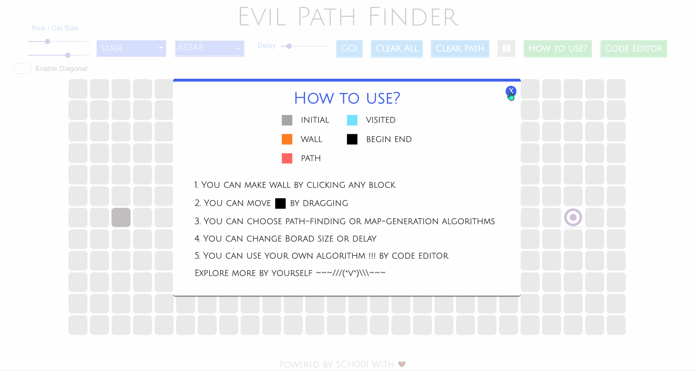
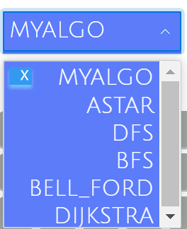
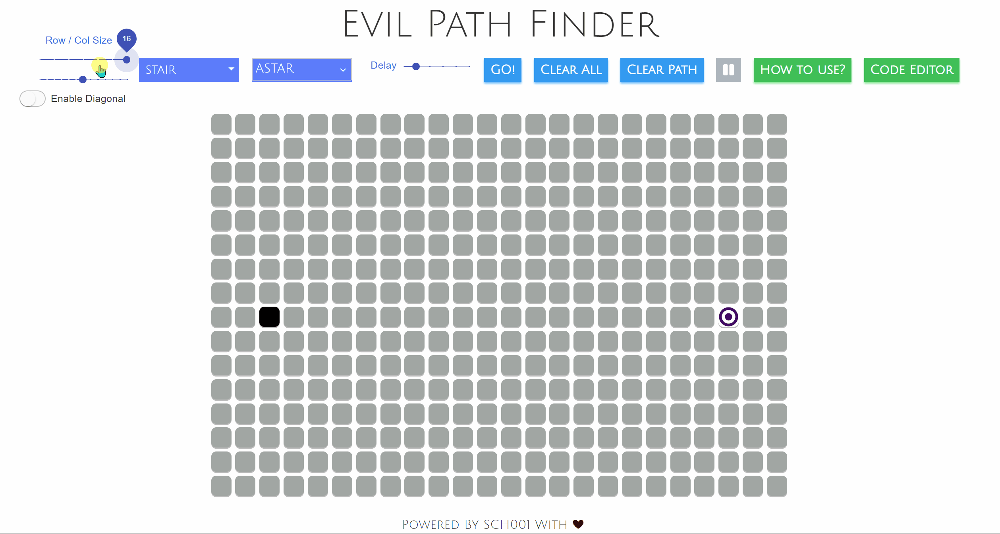
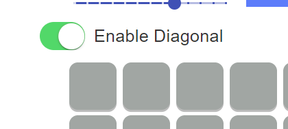
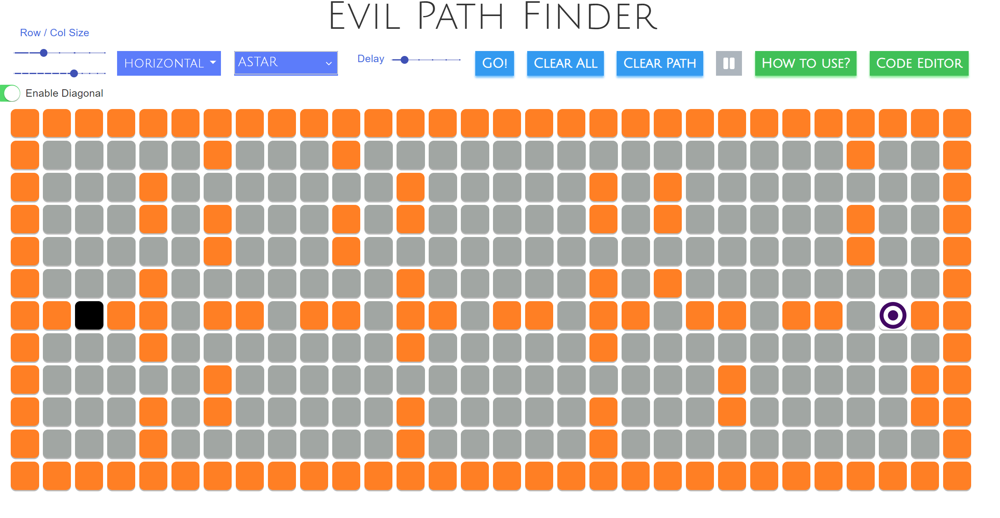
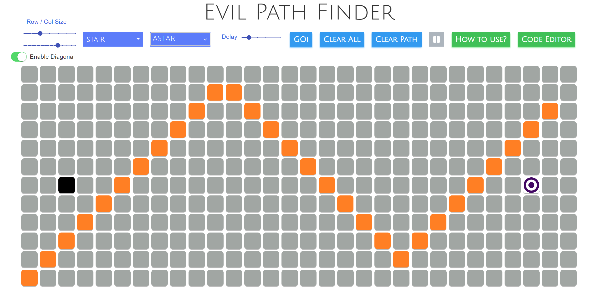
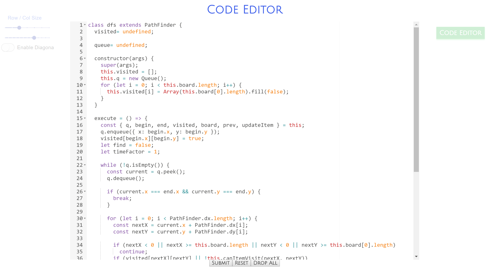

## 寻路算法可视化

[TOC]

### Overview

> 若在 .pdf 文件无法查看动图(.gif)，可用 markdown 编辑器直接打开 readme.md。



本项目是一个**寻路算法的可视化**，同时**支持用户自定义算法**并上传演示（可试用`algorithm`文件夹下的部分 `*.js`如`bfs.js` 进行尝试 or `code_editor_sample`文件夹）。

点击`HOW TO PLAY?`可以呼出帮助界面（**简单教程请看 How to Run 小节**）


不同颜色的格子表示不同的格子类型：

- 起点， START 
- 终点， END 
- 障碍（墙），可访问， WALL 
- 空白，可访问， INITIAL 
- 搜索到的最短路径， PATH 

### Technique

- React
- scss

### How to Run

```bash
yarn install
yarn start
```

Demo： https://hangshuaibi.github.io/Evil-Path-Finder/ 

> 好像用 vpn 加载会快很多

#### 简单教程

- 选择地图生成算法


- 选择搜索算法（可选）



- 点击 `GO!` 开始搜索路径！
  - 如果告知无法找到路径，则重新照着教程操作，总有一次能运行~ : )

### 背景介绍

- 算法可视化帮助我们更好地理解算法。
- 自定义算法运行验证是否符合自己的想法。

### 基本功能

支持多种算法参数的调节，包括：

- 迷宫大小
- 算法展示延迟
  - 拖拽 Delay 滑动条
- 起点终点修改
  - 拖拽起点和终点
- 是否允许对角线行走
  - 默认只能往上下左右行走
- 点击空白格子可使其变成障碍
- 点击障碍格子可变成空白

#### 迷宫大小调节



#### 算法展示延迟

调节 上方的`Delay`滑动条可以调整算法展示的延迟，这样会有更好的可视化效果。

#### 是否允许对角线

默认情况下，算法在寻找可行路径时，只能往上下左右四个方向前进。勾选如下按钮即可允许对角线行走，此时寻路算法可以往上下左右及四个对角线 8 个方向行走。



#### 修改起点和终点

拖拽起点和终点可以改变起点和终点的位置。

### 主要算法

#### 迷宫生成算法

当前支持三种地图算法的生成：

- Stair
- Horizontal
- Vertical

以下为算法的生成结果。





迷宫的障碍除了可以试用地图算法**自动生成**外，还可以通过点击格子使其由**障碍和空白**两种状态互相切换。

#### 寻路算法

初始时会为用户提供五种算法：

- A Star
- DFS
- BFS
- Bell Ford
- Dijkstra

找到的路径是否视最短路径，视具体算法性质而定，除 dfs 外其他算法均可保证找到的路径是最短路径

除以上提供的算法外，用户还可以自定义算法，后面会重点介绍。

### 代码编辑器

#### 基本介绍

点击右侧的 `CODE EDITOR` 按钮可以呼出代码编辑器：



可以对代码进行编辑，会有简单的代码补全。点击 `SUBMIT` 按钮提交算法，该算法会被添加到主页的算法选择下拉框，此时用户可以选择其执行。

代码若存在一些简单的语法错误，提交代码后会提示用户：


> - 你可以将 custom_editor_example 文件下的 .js 复制到编辑器中
> - 或者使用 algorithm/ 文件夹下的 dfs.js / bfs.js / bell-ford.js / astar.js / dijkstra.js

#### 重置算法和保存、删除

点击 `RESET` 可以将重置代码，每次提交系统都会自动为用户保存代码。**代码编辑器的最新版本会被持久化，刷新界面后仍可以修改、运行自定义算法。**

自定义代码可以被用户删除，删除后需要刷新页面，算法会从下拉框中消失。


这里（故意）没有提供系统原始算法的删除，主要是考虑到用户误删导致重新恢复较为繁琐。

### 杂项

点击 `GO!` 按钮开始执行算法，开始运行算法后按钮会被 disabled ：


可以点击暂停按钮暂停算法，暂停后可恢复执行、中断执行（通过清空地图、清空路径）等。

---

更多功能，请自行探索~