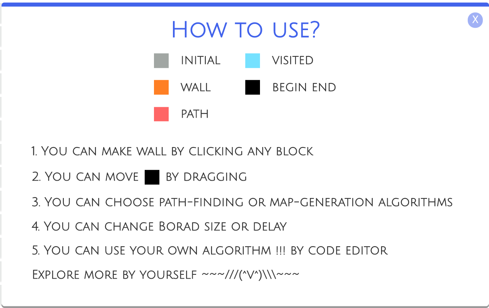

## 寻路算法可视化

[TOC]

### Overview


本项目是一个寻路算法的可视化，同时支持用户自定义算法并上传演示（可试用`algorithm`文件夹下的 `.js`如`bfs.js` 进行尝试）。

点击`HOW TO PLAY?`可以呼出帮助界面



### Technique

- React
- scss

### Run

```bash
yarn install
yarn start
```

### 基本功能

支持各种算法参数的调节，包括迷宫大小、算法展示延迟、起点终点修改、是否允许对角线等。

#### 迷宫大小调节


#### 算法展示延迟

调节 上方的`Delay`滑动条可以调整算法展示的延迟，这样会有更好的可视化效果。

#### 是否允许对角线

默认情况下，算法在寻找可行路径时，只能往上下左右四个方向前进。勾选如下按钮即可允许对角线行走。


#### 修改起点和终点

拖拽起点和终点可以改变起点和终点的位置。

### 主要算法

#### 迷宫生成算法

当前支持三种地图算法的生成：

- Stair
- Horizontal
- Vertical


迷宫的障碍除了可以试用地图算法自动生成外，还可以通过点击格子使其由**障碍和空白**两种状态互相切换。

#### 寻路算法

初始时会为用户提供五种算法：

- A Star
- DFS
- BFS
- Bell Ford
- Dijkstra

除自定义算法外，还可以自定义算法，后面会终点介绍。

### 代码编辑器

#### 基本介绍

点击右侧的 `CODE EDITOR` 按钮可以呼出代码编辑器：


可以对代码进行编辑，会有简单的代码补全。点击 `SUBMIT` 按钮提交算法，该算法会被添加到主页的算法选择下拉框，此时用户可以选择其执行。

代码若存在一些简单的语法错误，提交代码后会提示用户：


#### 重置算法和保存、删除

点击 `RESET` 可以将重置代码，每次提交系统都会自动为用户保存代码。**代码编辑器的最新代码版本会被持久化，刷新界面后仍可以修改、运行自定义算法。**

自定义代码可以被用户删除，删除后需要刷新页面，算法会从下拉框中消失。


这里暂时没有提供系统提供的原始算法的删除，主要是考虑到用户误删导致重新恢复较为繁琐。

### 杂项


点击 `GO!` 按钮开始执行算法，开始运行算法后按钮会被 disabled ：


可以点击绿色按钮暂停算法，暂停后可恢复执行、中断执行（通过清空地图、清空路径）等。
